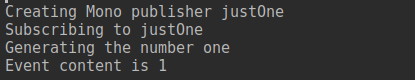
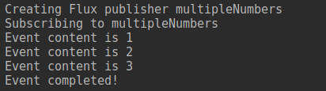
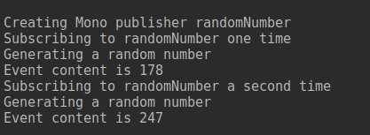
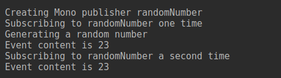
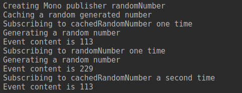
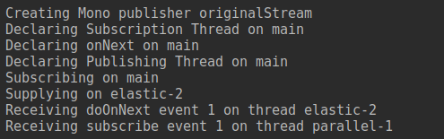
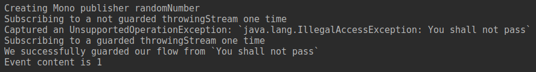

# Project Reactor

Reactor é uma biblioteca interessada em disponibilizar uma API alternativa para lidar com o paradigma reativo e o uso de APIs não bloqueantes no universo JVM.

E ai você me pergunta, por que nós nos interessariamos por isso?

No nosso mundo atual, nós podemos estar lidando com milhares de usuários concorrentes, o que nos faz por várias vezes ter de lidar com questões de como melhor utilizar nossos recursos para minimizar a quantidade de tempo perdido de uma aplicação ou de um usuário.

Usando os nossos padrões bloqueantes, nós nos encontramos com alguns problemas ao tentar escalar uma aplicação: Ao utilizar chamadas IO(i.e. databases, requests HTTP, acessos a disco) nós criamos uma ineficiência em relação ao nosso tempos de máquina.

Isso se dá pois assim que fazemos a operação desejada, nós travamos a thread atual do programa para fazer o pedido. Como essas operações tendem a ter tempo de resposta maior que o usual, isso tira a oportunidade de executarmos outros fragmentos de códigos que tenham menos overhead, desperdiçando recursos que poderiam estar sendo utilizados por outras operações.

Ao usar o paradigma reativo, nós permitimos que enquanto nós esperamos o progresso das chamadas IO, nós possamos fazer progresso em outras frentes, pois o trabalho executado por padrão não será irá esperar parado pelos resultados, mas sim **reagirá** ao resultado uma vez que este tenha completado.

## Lidando com Reactor

Para criar um processo reativo, primeiro precisamos definir as caracteristicas do fluxo de dados que lidaremos. Quem define essas caracteristicas é o `Publisher`, que permite em cima dele definirmos as nossas respostas aos resultados anteriores.

Para iniciar, falaremos sobre o `Mono`, o `Mono` é um publicador que por definição somente irá enviar um dado, o qual chamarei de evento daqui em diante.

```kotlin
private fun `creating and executing a Mono Stream`() {

    println("Creating Mono publisher justOne")
    val justOne = Mono.fromSupplier {
        println("Generating the number one")
        1
    }

    println("Subscribing to justOne")
    justOne
        .doOnSuccess { event -> printEvent(event) }
        .subscribe()
}
```



Como percebido, nós podemos passar para `doOnSuccess` o comportamento esperado em caso de compleção do fluxo. Em `Mono`s, nós temos diversos métodos `doOnSomething`. Esses métodos recebem o evento desejado e executam o código passado para causar algum efeito colateral.

Além disso, temos também os operadores clássicos da programação funcional, como `map`, `flatMap`, `filter`, que transformam o contéudo do fluxo diretamente e definem o que será passado adiante.

Porém isso levanta a questão: E se quisermos ter um publicador de diversos eventos? Se temos um operador de `flatMap`, faz sentido que possamos lidar com um fluxo de diversos eventos.
 
Para esses caso, podemos utilizar o `Flux`. Esse é geralmente usado para passar dados por fragmentos ou para demonstrar mudança de estado. A API deste é bem similar, porém com algumas substituições, como a perda do `doOnSuccess`, que recebia o único evento do `Mono`, para o `doOnNext`, que é chamado para cada evento, e o `doOnComplete`, que não recebe nenhum evento e é chamado quando o fluxo é marcado quando terminado.

```kotlin
private fun `creating and executing a Flux Stream`() {

    println("Creating Flux publisher multipleNumbers")
    val multipleNumbers = Flux.just(1, 2, 3)

    println("Subscribing to multipleNumbers")
    multipleNumbers
        .doOnNext { event -> printEvent(event) }
        .doOnComplete { println("Event completed!") }
        .subscribe()
}
```



Quando criando ou lidando com esses dois tipos de publicador, ele não irá fazer nenhuma operação por padrão, para podermos executa-lo, nós precisamos inscrever nele.

Esse é um detalhe muito importante de se lembrar, pois no caso estramos lidando com um `Cold Publisher`. Esse tipo de publicador é bem próximo de um Runnable`, é uma sequência de código que será executado toda vez que alguém se inscrever. Isso pode ser observado no próximo fragmento de código:

```kotlin
private fun `creating and executing a Mono Stream that has logic inside`() {

    println("Creating Mono publisher randomNumber")
    val randomNumber = Mono.fromSupplier {
        println("Generating a random number")
        Random.nextInt(0, 255)
    }

    println("Subscribing to randomNumber one time")
    randomNumber.subscribe { event -> printEvent(event) }

    println("Subscribing to randomNumber a second time")
    randomNumber.subscribe { event -> printEvent(event) }
}
```

Nesse exemplo nós nos inscrevemos duas vezes ao mesmo publicador. Dado isso, ele executa o código dado toda vez que alguém se inscreve a este:



Porém além destes, nós temos também o conceito de `Hot Publisher`. Quando nós estamos lidando com estes, a operação só é executada uma vez e passada a frente toda vez que chamada.

```kotlin
private fun `creating and executing a hot Mono Stream that has logic inside`() {

    println("Creating Mono publisher randomNumber")
    val randomNumber = Mono.fromSupplier {
        println("Generating a random number")
        Random.nextInt(0, 255)
    }

    println("Caching a random generated number")
    val cachedRandomNumber = randomNumber.cache()

    println("Subscribing to cachedRandomNumber one time")
    cachedRandomNumber.subscribe { event -> printEvent(event) }

    println("Subscribing to cachedRandomNumber a second time")
    cachedRandomNumber.subscribe { event -> printEvent(event) }
}
```



Como perceptível, nós começamos nosso publicador como um `Cold Publisher` e por meio de um operador, no caso o `cached`, nós transformamos ele em um `Hot Publisher`, que já teve seu resultado pré-computado.

Isso ocorre pois a cada operador que adicionamos, nós criamos mais um publicador que está ligado ao anterior. Vide o próximo exemplo:

```kotlin
private fun `executing a hot Mono Stream and the cold stream that provides for it`() {

    println("Creating Mono publisher randomNumber")
    val randomNumber = Mono.fromSupplier {
        println("Generating a random number")
        Random.nextInt(0, 255)
    }

    println("Caching a random generated number")
    val cachedRandomNumber = randomNumber.cache()

    println("Subscribing to cachedRandomNumber one time")
    cachedRandomNumber.subscribe { event -> printEvent(event) }

    println("Subscribing to randomNumber one time")
    randomNumber.subscribe { event -> printEvent(event) }

    println("Subscribing to cachedRandomNumber a second time")
    cachedRandomNumber.subscribe { event -> printEvent(event) }
}
```



E após falarmos tanto sobre operações paralelas na introdução, nós temos a obrigação de apresentar como nós trabalhamos com as operações de IO. Um exemplo simplificado pode ser visto abaixo:

```kotlin
private fun `executing a Mono Stream on another Thread`() {

    println("Creating Mono publisher originalStream")
    val originalStream = Mono.fromSupplier {
        println("Supplying on ${Thread.currentThread().name}")
        1
    }

    println("Declaring Subscription Thread on ${getThreadName()}")
    val subscribedOn = originalStream.subscribeOn(Schedulers.elastic())

    println("Declaring onNext on ${getThreadName()}")
    val onNexted = subscribedOn.doOnNext { event -> printThreaded(event, "doOnNext") }

    println("Declaring Publishing Thread on ${getThreadName()}")
    val publishedOn = onNexted.publishOn(Schedulers.newParallel("parallel"))

    println("Subscribing on ${getThreadName()}")
    val disposable = publishedOn.subscribe { event -> printThreaded(event, "subscribe") }

    while (!disposable.isDisposed) { }
}
```



Como visto acima, novamente temos a mostra como as operações só serão aplicadas uma vez que tivermos inscrito nesta.

Com isso, temos dois operadores que lidam com a especificação de threads:
- `subscribeOn` - Define a thread para os passos anteriores e próximos.
- `publishOn` - Define a thread para os próximos passos.

Com isso, nós podemos arquitetar melhor como organizaremos nosso fluxo, de maneira a otimiza-lo.

E tudo isso é ótimo, porém temos uma preocupação: O que ocorre caso um erro ocorrer?

```kotlin
private fun `executing a failed Mono Stream`() {

    println("Creating Mono publisher randomNumber")
    val throwingStream = Mono.fromSupplier<Int> {
        throw IllegalAccessException("You shall not pass")
    }

    println("Subscribing to a not guarded throwingStream one time")

    try {
        throwingStream.subscribe { event -> printEvent(event) }
    } catch (e: IllegalAccessException) {
        println("Captured an IllegalAccessException: `${e.message}`")
    } catch (e: UnsupportedOperationException) {
        println("Captured an UnsupportedOperationException: `${e.message}`")
    }

    println("Subscribing to a guarded throwingStream one time")

    throwingStream
        .doOnError { error -> println("We successfully guarded our flow from `${error.message}`") }
        .onErrorReturn(1)
        .subscribe { event -> printEvent(event) }
}
```



Como percebido, o Reactor joga uma exceção em caso de erros internos, a não ser que nós nos defendamos com algum tratamento para erros, um cuidado que sempre deve ser tomado.

Inclusive, é possível que tenhamos uma falha numa thread separada que não pare o fluxo de execução e falhe silenciosamente, então sempre devemos ter cuidado com essa questão.

### Pensamentos

Como mostrado acima, a API do Reactor é extremamente poderosa e dá um grande nível de controle ao programador, às custas de simplicidade. Quando colocado na balança, a escolha de uso de APIs reativas parece ser uma escolha de necessidade, pois ela pode complicar desnecessariamente uma aplicação que pode ser simples. Por outro lado, em uma aplicação que deva lidar com números absurdos de requests a cada segundo, a modularidade e eficiência da abordagem reativa pode ser a melhor escolha para minimizar a perda de performance com operações que gastem muito tempo paradas.

Porém ela é uma API que necessita que o usuário tenha um modelo de funcionamento de seu funcionamento o tempo inteiro. O modelo mais interessante, em minha opinião, é o de que os publicadores são super funções e as inscrições invocações destas.

## Extra

### Spring Cloud Gateway

Uma das APIs que utilizam o Project Reactor em seu fundo é o Spring Cloud Gateway, que tem como finalidade rotear requests recebidas para outros serviços. Para isso, é utilizada a mentalidade reativa para gerenciamento das chamadas, executada principalmente por meio de filtros.

A definição de um filtro é um objeto que possa receber uma `ServerWebExchange`, um objeto contendo dados de request e response de uma chamada, e uma `GatewayFilterChain`, um objeto contendo quais os próximos filtros a serem executados. Além disso, por definição, ele devolve um `Mono<Void>`, que é usado para representar uma execução sem retorno.

Isso se dá pois quando lidando com um filtro, nós estamos declarando ações a serem tomadas quando executando lidando com uma chamada, mas essas ações podem ou não ser executadas dependendo das circunstâncias, logo tendo um funcionamento totalmente reativo.

Para executarmos 

#### Como funciona

# TL;DR

## Modelos

- **Event** - Um sinal que será propagado pelo fluxo.
- **Publisher** - Um objeto que pode publicar Events. 
- **Mono** - Publisher que enviará 0..1 eventos ou um erro. Usado para aquisição de recursos simples e execução de código.
- **Flux** - Publisher que enviará 0..N eventos e/ou um erro. Usado para aquisição de rescursos fragmentados ou para demonstrar mudança de estado.

## Tipos de Inscrição

- **Hot Stream/Publisher** - Inscrição na qual os eventos são pré calculados independente de se alguém está ouvindo o publisher.
- **Cold Stream/Publisher** - Inscrição na qual os eventos são iniciados somente a partir do momento que alguém se inscreve no publisher.

## Métodos importantes

Quando não notado, os métodos servirão tanto para `Mono`s e `Flux`s. Caso contrário, ele será exclusivo do tipo citado.

- Geração:
    - **just** - Para criação de publicadores com contéudo pré-definido.
    - **defer** - Para criação de publicadores com lógica de obtenção de eventos.
    - **Mono.fromCallable** - Para criação de publicadores com lógica de obtenção de eventos.
    - **Mono.fromSupplier** - Para criação de publicadores com lógica de obtenção de eventos.
    - **Mono.fromRunnable** - Para criação de publicadores puramente lógicos e sem evento.
    - **Flux.fromIterable** - Para criação de publicadores com contéudo pré-definido.
    - **Flux.from** - Para criação de publicadores com lógica de obtenção de eventos.

- Efeitos colaterais:
    - **doOnNext** - Relacionados ao lançamento de eventos dentro de um fluxo.
    - **doOnError** - Relacionados à erros dentro do fluxo.
    - **Mono.doOnSuccess** - Relacionados à compleção de um fluxo. Semelhantea `doOnNext`, salvo quando o `Mono` é completado sem eventos, que ele é chamado com `null`.
    - **Flux.doOnCompleted** - Relacionados à compleção de um fluxo.
    
- Inscrição:
    - **subscribe** - Ativa o fluxo e se inscreve para este.
    - **block** - Bloqueia o contexto atual até ter o retorno da execução. O uso deste operador não é recomendado por não bater com as expectativas reactivas e só deve ser usado quando necessário.

- Definição de contexto:
    - **subscribeOn** - Para definição de thread de execução para os publishers anteriores e posteriores.
    - **publishOn** - Para definição de thread de execução para publishers posteriores.

- Operadores funcionais:
    - **filter** - Barra a passagem de itens que não batam com o predicado passado.
    - **map** - Transforma cada item do fluxo em um novo item.
    - **flatMap** - Transforma cada item do fluxo em uma lista de novos itens.
    - **zip** - Cria um novo fluxo que combina os itens de mesma posição de dois fluxos.
    - **reduce** - Aplica uma operação a cada componente da lista, tendo um resultado único final.

- Mudança de fluxo:
    - **then** - Executa um outro publicador após o encerramento do atual.
    - **thenMany** - Executa um outro publicador após o encerramento do atual.
    - **switchIfEmpty** - Executa um outro publicador se não houverem eventos no momento de compleção.
    
- Tratamento de erros:
    - **onErrorResume** - Executar um novo fluxo ao encontrar erros.
    - **onErrorMap** - Transforma a exceção atual em uma nova exceção.

## Pros and Cons

### Prós
- Observável.
- Não bloqueante.
- Fácil para quem entende `Rx`.
- Baseado na mesma especificação que `RxJava` segue, a `Reactive Streams`.

### Contras
- Fluxo confuso a quem acostumado com programação procedural, orientada a objetos ou com eager evaluation.
- Stacktrace inchada e dificil de acompanhar.
- APIs não necessariamente claras em seus nomes.

# Fontes
- [Documentação - Project Reactor](https://projectreactor.io/docs/core/release/reference/index.html#about-doc)

## Recomendações
- [Which operator do I need? - Project Reactor](https://projectreactor.io/docs/core/release/reference/index.html#which-operator)
- [Spring Reactor Tutorial - Dhananjay Singh](https://stackabuse.com/spring-reactor-tutorial/)
